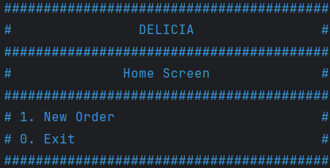
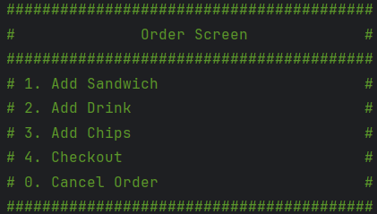
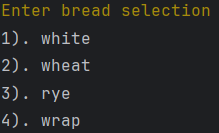
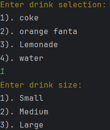
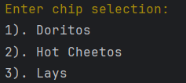
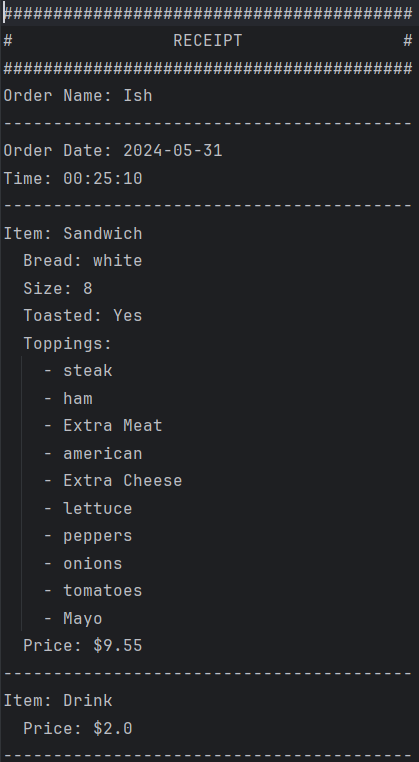

# DELICIA2.1 

## Introduction

DELICIA is a point of sale (POS) system designed for a custom sandwich shop. The application allows users to create new orders, add various items (sandwiches, drinks, chips) to the order, and generate receipts. Each receipt is saved in a unique file for record-keeping.

## Features

- **Home Screen**: Start a new order or exit the application.
- **Order Screen**: Add sandwiches, drinks, or chips to the order, checkout, or cancel the order.
- **Sandwich Customization**: Choose bread type, size, whether it's toasted, and add multiple toppings.
- **Receipt Generation**: Generates a detailed receipt for each order and saves it to a unique file.

## Prerequisites

- Java Development Kit (JDK) 8 or higher
- A text editor or an IDE (like IntelliJ IDEA)

## How to Use

### Home Screen

Upon running the application, you will be presented with the home screen:

- **Enter `1` to start a new order**.
- **Enter `0` to exit the application**.

### New Order

If you choose to start a new order, you will be asked to enter the order name. After that, you will be taken to the order screen.

### Order Screen

In the order screen, you can add sandwiches, drinks, chips, or proceed to checkout.

- **Enter `1` to add a sandwich**.
- **Enter `2` to add a drink**.
- **Enter `3` to add chips**.
- **Enter `4` to checkout and generate a receipt**.
- **Enter `0` to cancel the order**.

### Adding a Sandwich

When adding a sandwich, you will be prompted to customize it by selecting bread type, size, whether it's toasted, and various toppings.

- **Enter the number corresponding to your bread choice**.
- **Enter the sandwich size (4", 8", 12")**.
- **Enter `yes` or `no` to indicate if you want it toasted**.
- **Choose toppings by entering their corresponding numbers (comma-separated or none)**.
- **Indicate if you want extra meat or cheese by entering `yes` or `no`**.

### Adding a Drink

When adding a drink, you will be prompted to select the type and size of the drink.

- **Enter the number corresponding to your drink choice**.
- **Enter the number corresponding to your drink size choice**.

### Adding Chips

When adding chips, you will be prompted to select the type of chips.

- **Enter the number corresponding to your chip choice**.

### Checkout

After adding all desired items to the order, you can proceed to checkout.

A detailed receipt will be generated and displayed on the screen, and a copy will be saved to a unique file in the `C:/PluralSight/delicia/receipts/` directory.

### Example Receipt

